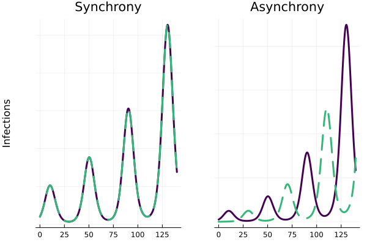

# asynchrony

## About

A Julia port of the supporting code supporting the following manuscript: 

>Kortessis N, Simon MW, Barfield M, Glass GE, Singer BH, Holt RD. The interplay of movement and spatiotemporal variation in transmission degrades pandemic control. Proceedings of the National Academy of Sciences 2020;117:30104–6. https://doi.org/10.1073/pnas.2018286117.

The original MATLAB code is available [here](https://github.com/kortessis/SpatioTemporal_COVID-19/tree/master).

## Installation

To install this package you can do the following in an open Julia session

```julia
] add https://github.com/wf-id/asynchrony.git
```



